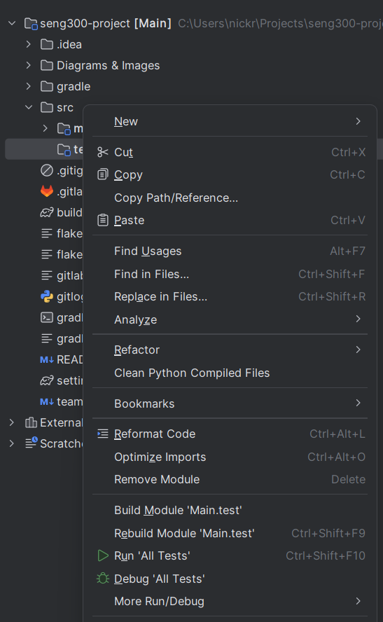
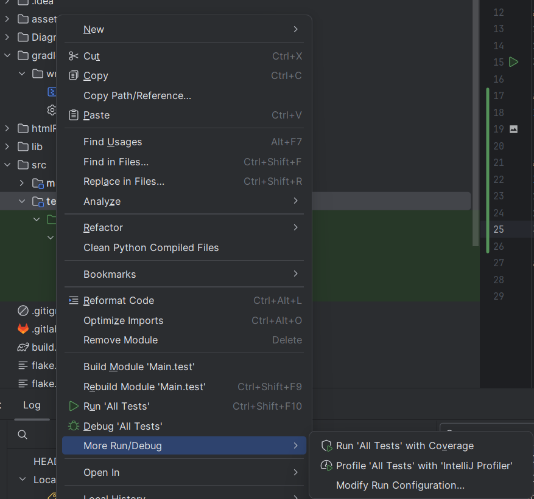

README File: Include a `README.md` file in your Git repository and in the D2L Dropbox, with instructions on how
to run the program, a brief description of the game's objective, and an overview of the project's structure. It
should describe the steps needed to optionally read from an input file on start-up (using command line arguments)
and how to backup stored data.

# SENG 300 Group Project - P6
## Instructions to run the program:

### Requirements:
- gradle

### Steps:
1. Clone the repository
2. Navigate to the root directory of the project
3. run `gradle run` to run the program

## Run Instructions
### How to Run Tests

#### How to Run Tests on Command Line

1. Navigate to the root directory of the project
2. Run `gradle test` to run the tests

#### How to Run Tests in Intellij
Inside intellij right click on the test folder, and click "run all tests"

### How to Run Tests With Coverage in Intellij
Inside intellij
1. Right click on the test folder, and
2. Click "More Run/Debug"
3. Click "Run 'All Tests' with Coverage"
   

## Games Objective

### Game 1: Tic-Tac-Toe
The objective of the game is to get three of your symbols in a row, either horizontally, vertically, or diagonally.
Your opponent is trying to do the same thing, so you must try to block them while also trying to get your own symbols.

### Game 2: Connect Four
The objective of the game is to get four of your symbols in a row, either horizontally, vertically, or diagonally.

### Game 3: Checkers
The objective of the game is to capture all of your opponent's pieces or block them so they cannot make a move.

## Project Structure

### Integration
- ./java/src/ca/ucalgary/seng300/Main.java: The main file for the project
- ./build.gradle: The gradle build file
- ./.gitlab-ci.yml: The gitlab CI file for running tests
- ./src/test: The test files for the project
- ./src/main/java/src/ca/ucalgary/seng300/database: The database for the project

### GUI
- ./src/main/java/src/ca/ucalgary/seng300/gameApp/ScreenController.java: The main controller for the GUI
- ./src/main/java/src/ca/ucalgary/seng300/gameApp/*Screens/: The different screens for the GUI
- ./src/main/java/src/ca/ucalgary/seng300/images/*: The images used in the GUI

### GameLogic
- ./src/main/java/src/ca/ucalgary/seng300/gamelogic/Checkers/*: The checkers game logic
- ./src/main/java/src/ca/ucalgary/seng300/gamelogic/Connect4/*: The connect 4 game logic
- ./src/main/java/src/ca/ucalgary/seng300/gamelogic/tictactoe/*: The tic tac toe game logic

### Leaderboard

- ./src/ca/ucalgary/seng300/leaderboard/* : The leaderboard for the project

### Networking

- ./src/main/java/src/ca/ucalgary/seng300/network/Client.java: The client for the networking
- ./src/main/java/src/ca/ucalgary/seng300/network/Client*.java: The subclasses for different games / purposes

### Profile 

- ./src/main/java/src/ca/ucalgary/seng300/Profile/*: The profile for the project
